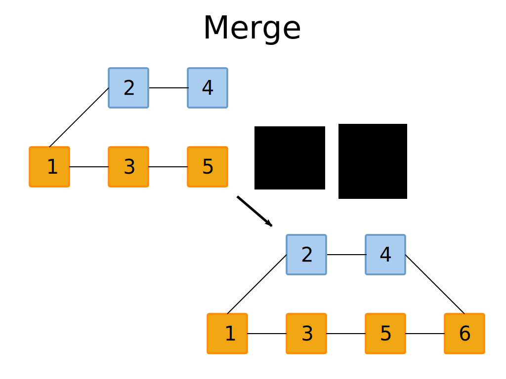
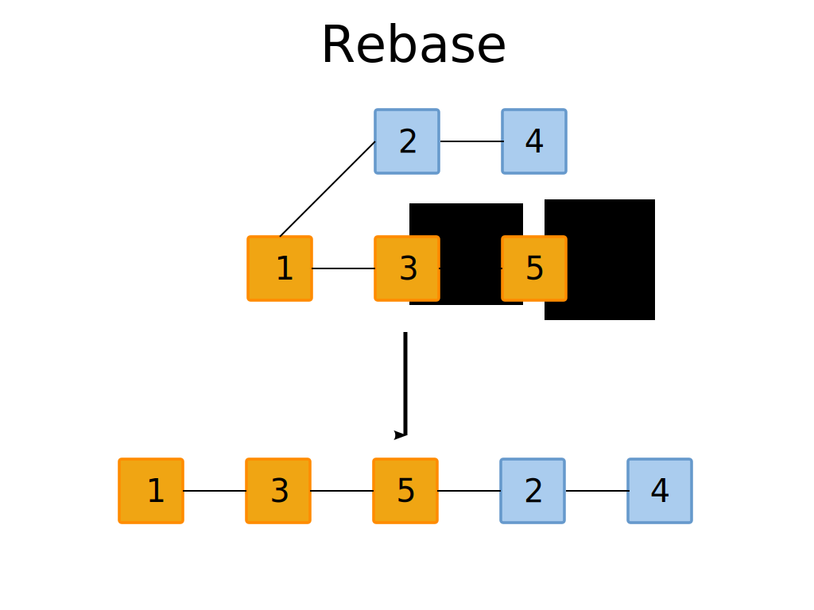

!SLIDE  commandline incremental
# Create a branch #

    $ git branch new_branch

    $ git checkout new_branch 
    
    Switched to branch 'new_branch'

!SLIDE commandline incremental
# Create and check out  branch

    $ git checkout -b another_branch

    Switched to a new branch 'another_branch'

!SLIDE commandline incremental
# List branches #

    $ git branch

    * another_branch
    master
    new_branch

!SLIDE commandline incremental 
# Edit file in branch

    $ echo minor edit >> tmp.txt

    $ cat tmp.txt

    foo
    minor edit

    $ git commit -am 'minor edit'

    [master c5c23b1] minor edit
    1 files changed, 1 insertions(+), 1 deletions(-)

    $ git checkout master

    Switched to branch 'master'

    $ cat tmp.txt

    foo

!SLIDE commandline incremental
# Edit file on master branch
  
    $  echo another edit >> tmp.txt

    $  cat tmp.txt
 
    foo
    another edit

    $ git commit -am 'another edit'

    [master 40fd970] another edit
    1 files changed, 1 insertions(+), 0 deletions(-)

    $ git log --graph --all

    * commit 40fd970ef0563410d14f4c8e3b8182f1c5c096dc
    | Author: Marcus Ahnve <marcus@ahnve.com>
    | Date:   Wed Mar 9 11:58:01 2011 +0100
    | 
    |     another edit
    |    
    | * commit 4e2bf677f395aca1fa49ddbdcd14c9a6c3616dff
    |/  Author: Marcus Ahnve <marcus@ahnve.com>
    |   Date:   Wed Mar 9 11:47:13 2011 +0100
    |   
    |       minor edit
    |  
    * commit 2a728d827291980c0182f4bdc41b53b51c99ee9c
    | Author: Marcus Ahnve <marcus@ahnve.com>
    | Date:   Wed Mar 9 11:41:49 2011 +0100
    | 
    |     change
    |  
    * commit 21a58a0d71b1e2b2da47999a43b2bffacfc354af
      Author: Marcus Ahnve <marcus@ahnve.com>
      Date:   Tue Mar 8 22:59:42 2011 +0100
      
          initial commit

!SLIDE full-page

!SLIDE full-page

!SLIDE
# Merging

    $ git merge another_branch

    Auto-merging tmp.txt
    CONFLICT (content): Merge conflict in tmp.txt
    Automatic merge failed; fix conflicts and then commit the result.

    $ cat tmp.txt

    foo
    another edit
    minor edit

    $ git add .

    $ 

