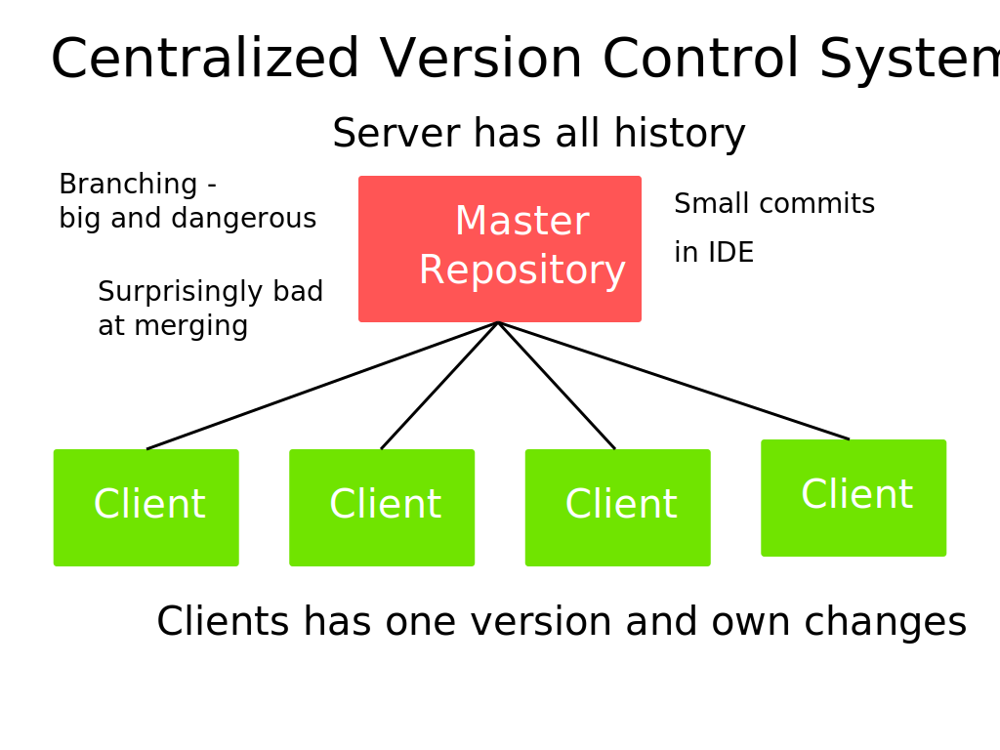
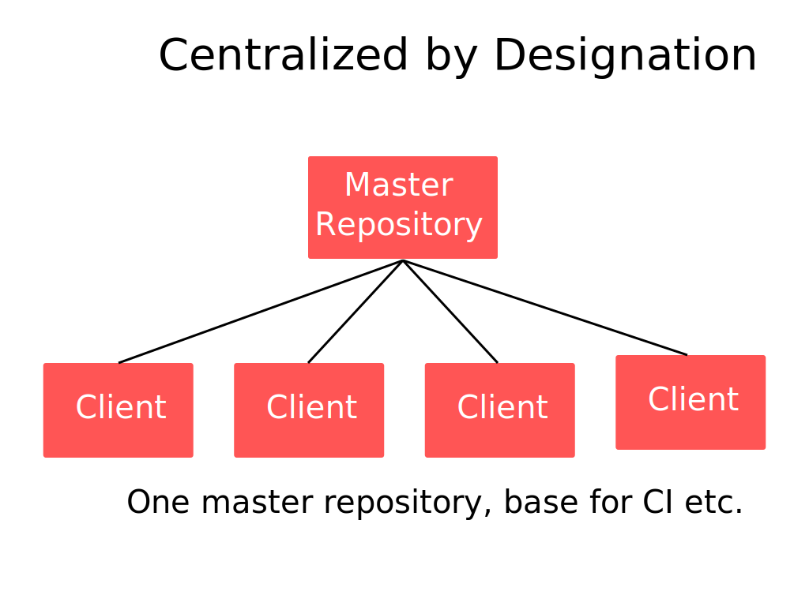

!SLIDE full-page 

!SLIDE bullets

# Problem with Centralized Version Control

* Offline - No such thing
* Branching - Big things 
* Small commits - implemented in IDE's instead
* Merging - Normally suck at branching

!SLIDE full-page 

!SLIDE full-page 

